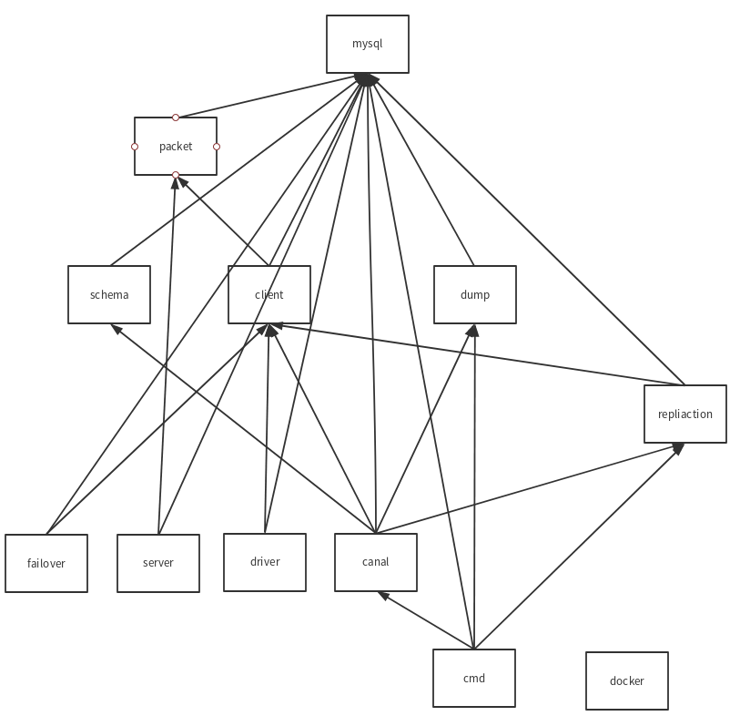

# go-mysql代码架构概述



如上图所示，go-mysql项目内的package，按依赖关系大致可以分为五层。

## 第一层：mysql

这个包内定义了各种MySQL所需的常量，和各种固定处理机制：

* MySQL error相关： Code，State，Message
* GTID相关
* MySQL结果集
* binlog
* 密码加密算法
* 大端序，小端序

## 第二层： packet

mysql协议包的读写。

## 第三层： schema， client， dump

### schema

MySQL表的解析和处理。

### client

一个轻量级的MySQL客户端

### dump

不同于mysqldump，这个包的设计目的是简单的解析和同步数据。

代码分为两部分：

* dump.go: 实现dump这个操作
* parser.go: binlog的解析

## 第四层： replication

处理MySQL的replication协议：
* backup： 参考mysqlbinlog remote raw backup， 备份远程的binlog到指定目录。
* binlogstreamer： 流式处理binlog中的event。
* binlogsyncer： 构造一个fake slave来同步binlog。
* paser： event的解析。

## 第五层： failover, server, dirver, canal

### failover

当master挂掉后：
1. 选出slave中数据最新的那个，作为新的master
2. 将其他slave的master设定成新的master

限制：
1. 所有的slave的master必须相同，选举的依据是master的server-id或者uuid。
2. 如果failover这个工具出了问题，整个拓扑逻辑可能会出错，需要手动纠正。
3. slave的replication模式必须相同，都使用GTID或者都不用GTID

### server

这个packge提供了一个框架来实现一个(**只**)可以处理client请求的MySQL server，可以用来构建MySQL proxy。

### driver

一个轻量级的MySQL driver，实现了database/sql/driver接口。

### canal

[alibaba/canal 阿里巴巴mysql数据库binlog的增量订阅&消费组件](https://github.com/alibaba/canal)

这个package参考阿里巴巴的canal做了一个go的实现，从依赖关系图上可以看出，这是replication和dump两个package的结合。

对外预留出来一个EventHandler接口，通过实现这个接口，可以实现一个类似于[go-mysql-elasticsearch](https://github.com/siddontang/go-mysql-elasticsearch)的工具。

## 第六层: cmd, docker

### cmd

这个目录有四个子目录，分别有一个main.go,可以编译出四个二进制文件：
* go-binlogparser
* go-canal
* go-mysqlbinlog
* go-mysqldump

### docker

这个文件夹下只有一个Makefile文件，功能是拉取作者提供的docker镜像来跑一些简单的测试。


# go-mysql使用说明

[项目地址](https://github.com/siddontang/go-mysql)

一个纯go的库，用于解决MySQL网络协议和repliaction

## Repliction

参考[python-mysql-replication](https://github.com/noplay/python-mysql-replication)，这个package负责解决MySQL replication协议。

它可以作为一个MySQL slave，从master同步binlog，然后进行其他操作。

### 使用示例

```go
import (
    "github.com/siddontang/go-mysql/replication"
    "os"
)
// Create a binlog syncer with a unique server id, the server id must be different from other MySQL's. 
// flavor is mysql or mariadb
cfg := replication.BinlogSyncerConfig {
    ServerID: 100,
    Flavor:   "mysql",
    Host:     "127.0.0.1",
    Port:     3306,
    User:     "root",
    Password: "",
}
syncer := replication.NewBinlogSyncer(cfg)

// Start sync with sepcified binlog file and position
streamer, _ := syncer.StartSync(mysql.Position{binlogFile, binlogPos})

// or you can start a gtid replication like
// streamer, _ := syncer.StartSyncGTID(gtidSet)
// the mysql GTID set likes this "de278ad0-2106-11e4-9f8e-6edd0ca20947:1-2"
// the mariadb GTID set likes this "0-1-100"

for {
    ev, _ := streamer.GetEvent(context.Background())
    // Dump event
    ev.Dump(os.Stdout)
}

// or we can use a timeout context
for {
    ctx, cancel := context.WithTimeout(context.Background(), 2*time.Second)
    ev, err := s.GetEvent(ctx)
    cancel()

    if err == context.DeadlineExceeded {
        // meet timeout
        continue
    }

    ev.Dump(os.Stdout)
}
```

The output looks:

```
=== RotateEvent ===
Date: 1970-01-01 08:00:00
Log position: 0
Event size: 43
Position: 4
Next log name: mysql.000002

=== FormatDescriptionEvent ===
Date: 2014-12-18 16:36:09
Log position: 120
Event size: 116
Version: 4
Server version: 5.6.19-log
Create date: 2014-12-18 16:36:09

=== QueryEvent ===
Date: 2014-12-18 16:38:24
Log position: 259
Event size: 139
Salve proxy ID: 1
Execution time: 0
Error code: 0
Schema: test
Query: DROP TABLE IF EXISTS `test_replication` /* generated by server */
```

## Canal

这个package可以同步MySQL到任何地方，比如Redis，Elasticsearch。

首先，canal会把MySQL的数据dump出来，然后通过binlog来进行增量同步。

binlog必须是ROW格式，推荐full binlog row image，否则当主键变更时可能出现错误。

### 使用示例
```go
cfg := NewDefaultConfig()
cfg.Addr = "127.0.0.1:3306"
cfg.User = "root"
// We only care table canal_test in test db
cfg.Dump.TableDB = "test"
cfg.Dump.Tables = []string{"canal_test"}

c, err := NewCanal(cfg)

type MyEventHandler struct {
    DummyEventHandler
}

func (h *MyEventHandler) OnRow(e *RowsEvent) error {
    log.Infof("%s %v\n", e.Action, e.Rows)
    return nil
}

func (h *MyEventHandler) String() string {
    return "MyEventHandler"
}

// Register a handler to handle RowsEvent
c.SetEventHandler(&MyEventHandler{})

// Start canal
c.Start()
```
可以参考[go-mysql-elasticsearch](https://github.com/siddontang/go-mysql-elasticsearch)，实现自己的同步工具。

## Client

这个package就是一个简单的MySQL driver。

### 使用示例

```go
import (
    "github.com/siddontang/go-mysql/client"
)

// Connect MySQL at 127.0.0.1:3306, with user root, an empty passowrd and database test
conn, _ := client.Connect("127.0.0.1:3306", "root", "", "test")

conn.Ping()

// Insert
r, _ := conn.Execute(`insert into table (id, name) values (1, "abc")`)

// Get last insert id
println(r.InsertId)

// Select
r, _ := conn.Execute(`select id, name from table where id = 1`)

// Handle resultset
v, _ := r.GetInt(0, 0)
v, _ = r.GetIntByName(0, "id") 
```
## Server

这个packge提供了一个框架来实现一个可以处理client请求的MySQL server，可以用来构建MySQL proxy。

### 使用示例

```go
import (
    "github.com/siddontang/go-mysql/server"
    "net"
)

l, _ := net.Listen("tcp", "127.0.0.1:4000")

c, _ := l.Accept()

// Create a connection with user root and an empty passowrd
// We only an empty handler to handle command too
conn, _ := server.NewConn(c, "root", "", server.EmptyHandler{})

for {
    conn.HandleCommand()
}
```

client 连接
```
mysql -h127.0.0.1 -P4000 -uroot -p 
//Becuase empty handler does nothing, so here the MySQL client can only connect the proxy server. :-) 
```
## Failover

这个package提供了当master挂掉后，自动选举出新的master，并使其他slave变更自己的master的功能。

支持MySQL 5.6.9以上，GTID模式/MariaDB 10.0.9以上，GTID模式。


## Driver

一个go mysql driver，能够像使用其他go mysql dirver那样，通过 `database/sql`使用。

### 使用示例

``` go
package main

import (
    "database/sql"

    _ "github.com/siddontang/go-mysql/driver"
)

func main() {
    // dsn format: "user:password@addr?dbname"
    dsn := "root@127.0.0.1:3306?test"
    db, _ := sql.Open(dsn)
    db.Close()
}

```