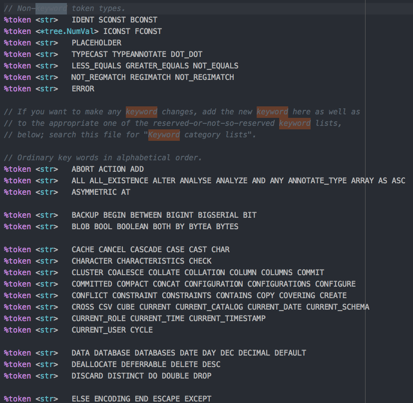
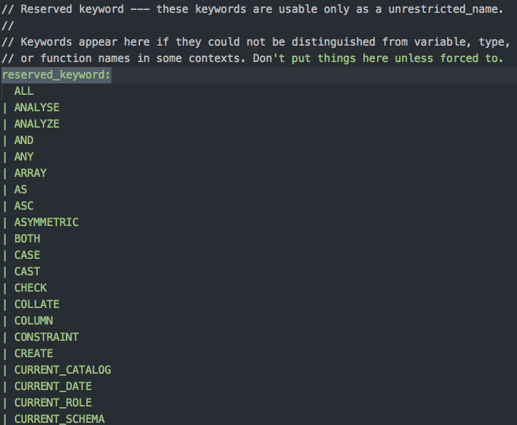
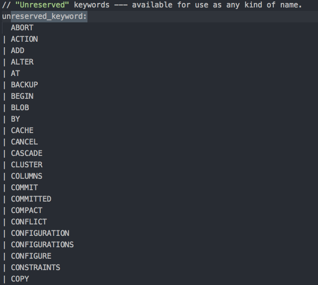
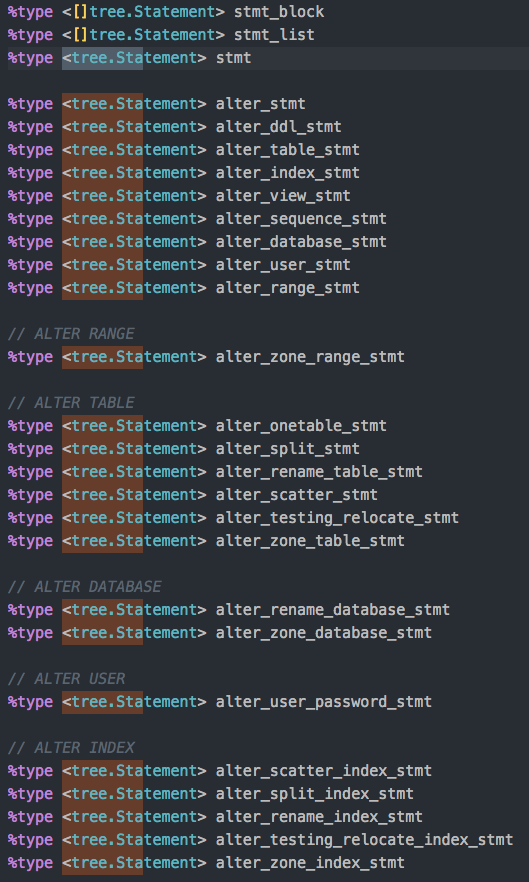
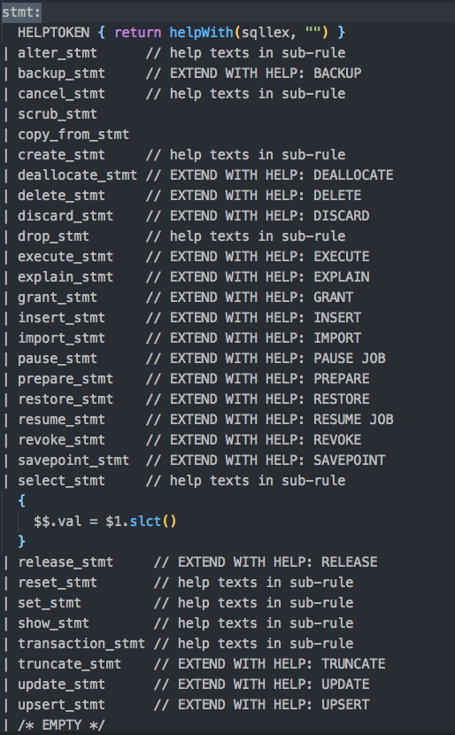
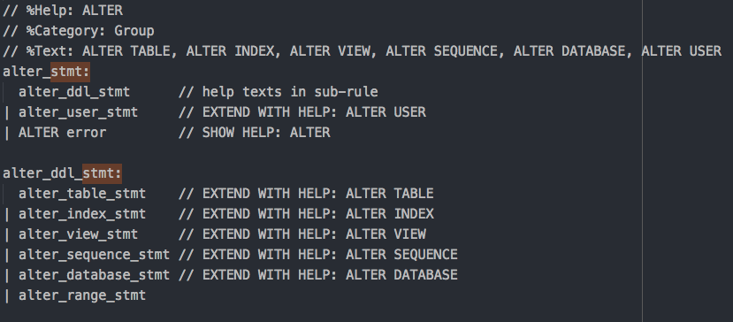
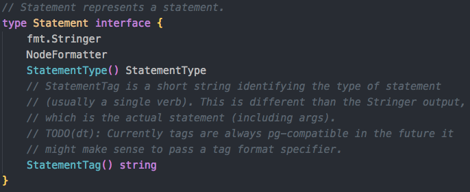
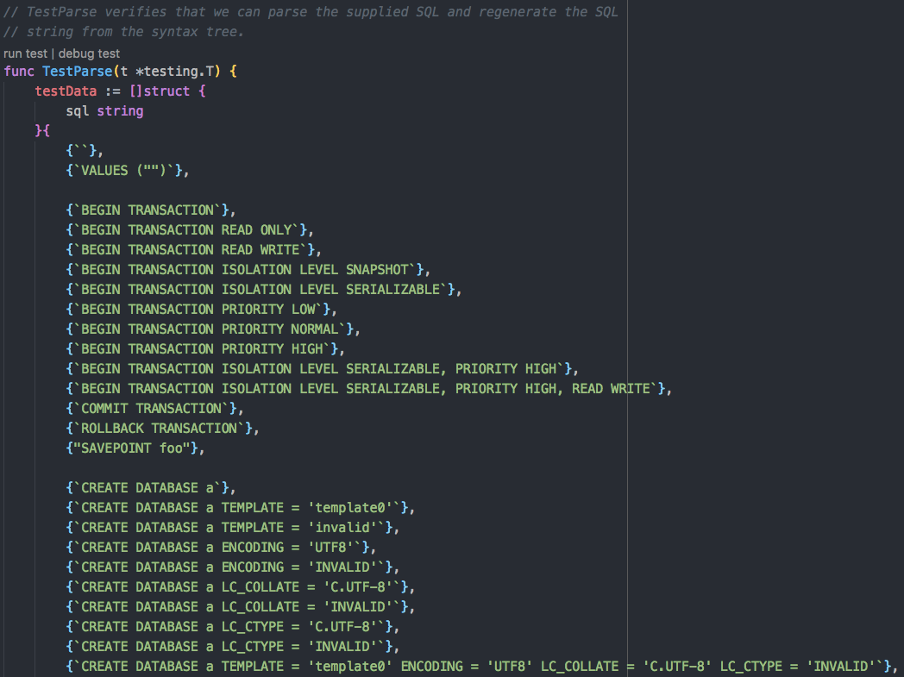
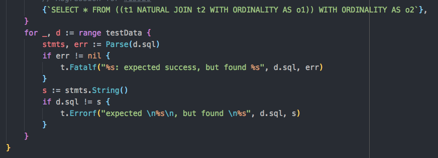
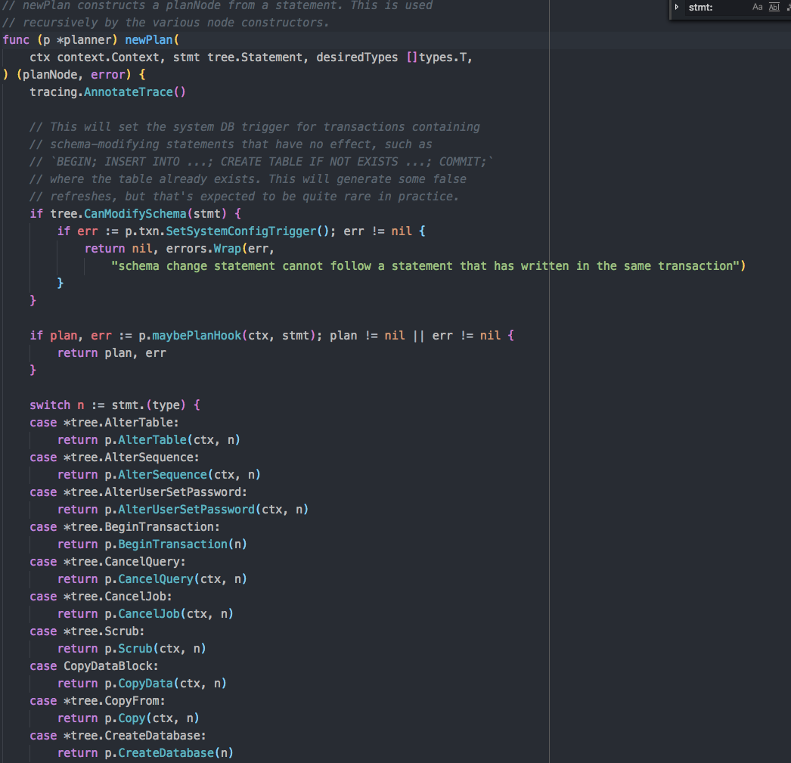

[文档源地址](https://github.com/cockroachdb/cockroach/blob/master/docs/codelabs/01-sql-statement.md)
### 准备知识

语法源文件`pkg/sql/parser/sql.y`，由`goyacc`生成。

整个AST（抽象语法树）的定义在`pkg/sql/sem/tree`目录下。

### adding a new statement to the SQL parser: 
* adding any new **keywords**, 
* adding **clauses** to the statement parser, 
* adding a new **syntax node type**.

### 以`Frobnicate`为例

假如我们要加一个CRDB的SQL方言语句叫：`FROBNICATE`。这个语句会随机改变数据库的设置。

它有三个选项：
* `FROBNICATE CLUSTER`, 更改集群的设置 
* `FROBNICATE SESSION`, 更改会话的设置 
* `FROBNICATE ALL`, 更改集群和会话的设置

首先，我们打开`sql.y`，搜索`keyword`，会看到一堆按字母排列的token定义。由于已经有了`SESSION`, `CLUSTER`, `ALL`，我们只需要添加`FROBNICATE`。



```yacc
%token <str> FROBNICATE
```
___

这样`lexer`就可以识别这个关键词，但是我们仍需要将其添加到**分类列表**里。

如果一个keyword可以出现在一个标识符位置，那么他就是一个保留（`reserved`）字（比如我们将保留字作为列名时，就必须加引号）。



由于我们新加的这个关键字必须出现在一个语句的开头，所以他不是在标识符位置，也就不是保留字，我们需要把它加到`unreserved keywords`列表里。



```
unreserved_keyword:
...
| FROBNICATE
...
```
___
现在词法解析器方面的工作就完成了，接下来是修改三个地方来告诉解析器怎么处理我们新的语句：
* type list
* statement cases list
* paring clause

在语法文件中搜索`<tree.Statement>`，会找到type list



我们在这里加一个新的语句类型
```
%type <tree.Statement> frobnicate_stmt
```
___

然后搜索`stmt`，可以找到一个关于`stmt`的产生式规则（production rule）列表：


在这里为我们的语句类型加一个case

```
stmt:
...
| frobnicate_stmt // EXTEND WITH HELP: FROBNICATE
...
```
---
接着，我们需要为我们的语句家一个产生式规则，在`stmt`列表下面的位置：

```
frobnicate_stmt:
  FROBNICATE CLUSTER { return unimplemented(sqllex, "frobnicate cluster") }
| FROBNICATE SESSION { return unimplemented(sqllex, "frobnicate session") }
| FROBNICATE ALL { return unimplemented(sqllex, "frobnicate all") }
```
这个列表里是三种我们允许的expression的形式，通过管道符分割开，然后把实现写在了后面的大括号里（当然现在他们只会报一个`unimplemented`错误）。

最后，我们来实现一个help：在产生式规则上面写这样的注释：
```
// %Help: FROBNICATE - twiddle the various settings
// %Category: Misc
// %Text: FROBNICATE { CLUSTER | SESSION | ALL }
```
---
为了让上面这些改动生效，我们需要先重新生成`sql.go`:
```
~/go/src/github.com/cockroachdb/cockroach$ make generate
...
Type checking sql.y
Compiling sql.go
...
```
然后编译项目
```
~/go/src/github.com/cockroachdb/cockroach$ make build
...
github.com/cockroachdb/cockroach
```
最后运行一下，看看效果：
```
$ ./cockroach sql --insecure -e "frobnicate cluster"
Error: pq: unimplemented at or near "cluster"
frobnicate cluster
           ^

Failed running "sql"
```
---
### 抽象语法树的森林

解决了语法之后，我们要为新语句加上适当的语义。我们需要一个AST节点，来进行解析器和运行时之间对语句结构的传递交流。

`%type <tree.Statement>`这个东西意味着需要去实现`tree.Statement`（`pkg/sql/sem/tree/stmt.go`）接口。



如图所示，要去实现这样四个函数。

---
我们将在一个新的文件（`pkg/sql/sem/tree/frobnicate.go`）中实现新的AST节点:

```go
package parser

import "bytes"

type Frobnicate struct {
    Mode FrobnicateMode
}

var _ Statement = &Frobnicate{}

type FrobnicateMode int

const (
    FrobnicateModeAll FrobnicateMode = iota
    FrobnicateModeCluster
    FrobnicateModeSession
)

func (node *Frobnicate) StatementType() StatementType { return Ack }
func (node *Frobnicate) StatementTag() string { return "FROBNICATE" }

func (node *Frobnicate) Format(buf *bytes.Buffer, f FmtFlags) {
    buf.WriteString("FROBNICATE ")
    switch node.Mode {
    case FrobnicateModeAll:
        buf.WriteString("ALL")
    case FrobnicateModeCluster:
        buf.WriteString("CLUSTER")
    case FrobnicateModeSession:
        buf.WriteString("SESSION")
    default:
        panic(fmt.Errorf("Unknown FROBNICATE mode %v!", node.Mode))
    }
}

func (node *Frobnicate) String() string {
    return AsString(node)
}
```
---
### 测试解析器

解析器的单元测试在`pkg/sql/parser/parse_test.go`中,里面大多数测试,都是简单地验证下示例语句有没有被正确地解析:





我们找一个合适的地方把我们的语句测例加进去:

```go
// ...
	{`FROBNICATE CLUSTER`},
	{`FROBNICATE SESSION`},
	{`FROBNICATE ALL`},
// ...
```
跑下测试:
```
$ make test
...
--- FAIL: TestParse (0.00s)
    parse_test.go:721: FROBNICATE CLUSTER: expected success, but found unimplemented at or near "cluster"
        FROBNICATE CLUSTER
...
```
失败了,因为我们还有工作要做.

---
### 完成解释器的修改

```
frobnicate_stmt:
  FROBNICATE CLUSTER { $$.val = &Frobnicate{Mode: FrobnicateModeCluster} }
| FROBNICATE SESSION { $$.val = &Frobnicate{Mode: FrobnicateModeSession} }
| FROBNICATE ALL { $$.val = &Frobnicate{Mode: FrobnicateModeAll} } 
```
`$$.val`代表这个规则生成的节点值.多出来的`$`表明这个可以用在yacc中.

一个更有用的形式是在子产生式中引用这个值(One of the more useful forms refers to node values of sub-productions)

For instance, in these three statements $1 would be the token `FROBNICATE`.


```
make generate
make test
```

再跑下测试:

```
$ ./cockroach sql --insecure -e "frobnicate cluster"
Error: pq: unknown statement type: *tree.Frobnicate
Failed running "sql"
```
这个和上面不一样的错误是由SQL planner报出来的,它现在还不知道怎么去处理这个新语句类型.

planner是集中调度语句的地方,因此我们要在这里添加语义.

`pkg/sql/plan.go`:



在这个type switch里我们加一个case:

```go
case *tree.Frobnicate:
    return p.Frobnicate(ctx, n)
```
接着我们在`pkg/sql/frobnicate.go`中实现这个方法:
```go
package sql

import (
    "fmt"

    "golang.org/x/net/context"

    "github.com/cockroachdb/cockroach/pkg/sql/sem/tree"
)

func (p *planner) Frobnicate(ctx context.Context, stmt *tree.Frobnicate) (planNode, error) {
    return nil, fmt.Errorf("We're not quite frobnicating yet...")
}
```
再测试一下:
```
$ ./cockroach sql --insecure -e "frobnicate cluster"
Error: pq: We're not quite frobnicating yet...
Failed running "sql"
```
我们已经能报出我们自己定义的错误信息了.

---
