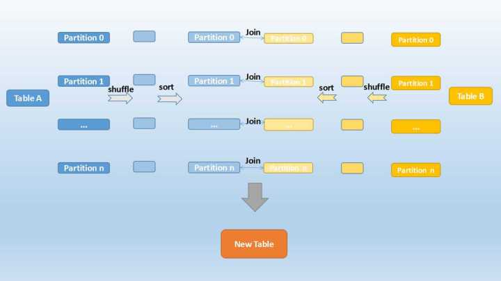

# 前言

这个调研主要是调研了整个SparkSQL的优化器框架，我觉得可以作为新产品优化器的TODO LIST，涉及的功能和内容，不一定都得我们自己来做，但要确保有这些东西而且能用，或者在这个列表的基础上增删。

# 参考资料

https://www.gitbook.com/book/jaceklaskowski/mastering-spark-sql/details

https://data-flair.training/blogs/spark-sql-optimization-catalyst-optimizer/

# SparkSQL 语句执行流程

## 标准的两阶段优化流程

1. Logical Analysis

2. Caching Replacement 

3. Logical Query Optimization (using rule-based and cost-based optimizations)

4. Physical Planning

5. Physical Optimization (e.g. Whole-Stage Java Code Generation or Adaptive Query Execution)

6. Constructing the RDD of Internal Binary Rows (that represents the structured query in terms of Spark Core’s RDD API)

## QueryExecution — Structured Query Execution Pipeline of Dataset

|Attribute / Phase|Description|
|-|-|
|analyzed|通过了解析器的检查|
|withCachedData|如果缓存中有所需数据，就以缓冲中的数据替换掉查询树的节点|
|optimizedPlan|优化过后的逻辑计划|
|sparkPlan|由QueryPlanner生成的一堆物理执行计划中的第一个|
|executedPlan|优化后的物理计划|
|toRdd|SparkSQL和SparkCore之间的一个分界，SQL执行计划会在这之后转化成Spark的计算流程|

# Catalyst Optimizer 

This optimizer is based on functional programming construct in Scala.

Catalyst Optimizer supports both rule-based and cost-based optimization. 

In rule-based optimization the rule based optimizer use set of rule to determine how to execute the query. 

While the cost based optimization finds the most suitable way to carry out SQL statement. In cost-based optimization, multiple plans are generated using rules and then their cost is computed.

## 催化剂优化器的组件

1. Trees

2. Rules

Rule是将一个Tree转换到另一个Tree的函数。

## Spark SQL Execution Plan

* Analysis
* Logical Optimization
* Physical planning
* Code generation

1. Analysis
对SQL Parser生成的AST进行分析：
* Search relation BY NAME FROM CATALOG.

* Map the name attribute, for example, col, to the input provided given operator’s children.

* Determine which attributes match to the same value to give them unique ID.

* Propagate and push type through expressions.

2. Logical Optimization

* constant folding （常数合并）
* predicate pushdown
* projection pruning （投影剪枝）
* other rules

3. Physical Planning

    In this phase, one or more physical plan is formed from the logical plan, using physical operator matches the Spark execution engine. 

    And it selects the plan using the cost model. It uses Cost-based optimization only to select join algorithms.

    For small relation SQL uses broadcast join, the framework supports broader use of cost-based optimization. It can estimate the cost recursively for the whole tree using the rule.

    Rule-based physical optimization, such as pipelining projections or filters into one Spark map Operation is also carried out by the physical planner. Apart from this, it can also push operations from the logical plan into data sources that support predicate or projection pushdown.

4. Code Generation

    在这个阶段就是将执行计划转换成Java字节码发送到每台机器上。

# 优化方式

## Hint Framework (Spark SQL 2.2)

简单说就是通过可执行注释的方式，向优化器提供优化的建议。嗯，人工智能，人工的智能。

这种优化适用于，没有或者没有足够的统计信息的时候（比如等等高直方图）。

##  Rule-Based Optimizer

* OptimizeMetadataOnlyQuery

* ExtractPythonUDFFromAggregate

* PruneFileSourcePartitions
	
* extraOptimizations

## Generic Rule-Based Query Optimizer (Catalyst Optimizer)

### 规则列表

* **Finish Analysis**
    
    EliminateSubqueryAliases
	
    EliminateView
	
    ReplaceExpressions
	
    ComputeCurrentTime 对应各种获取当前时间的函数
    
    GetCurrentDatabase 对应current_database()函数

    RewriteDistinctAggregates
	
    ReplaceDeduplicateWithAggregate

* **Union**

    CombineUnions

* **Subquery**

    OptimizeSubqueries

* **Replace Operators**

    ReplaceIntersectWithSemiJoin

    ReplaceExceptWithAntiJoin

    ReplaceDistinctWithAggregate

* **Aggregate**

    RemoveLiteralFromGroupExpressions
	
    RemoveRepetitionFromGroupExpressions

* **Operator Optimizations**

    PushProjectionThroughUnion
	
    ReorderJoin

    EliminateOuterJoin

    PushPredicateThroughJoin

    PushDownPredicate

    LimitPushDown

    ColumnPruning

    InferFiltersFromConstraints

    CollapseRepartition

    Collapses Repartition and RepartitionByExpression

    CollapseProject

    CollapseWindow

    CombineFilters

    CombineLimits

    CombineUnions

    NullPropagation

    FoldablePropagation

    OptimizeIn

    ConstantFolding

    ReorderAssociativeOperator

    LikeSimplification

    BooleanSimplification

    SimplifyConditionals

    RemoveDispensableExpressions

    SimplifyBinaryComparison

    PruneFilters

    EliminateSorts

    SimplifyCasts

    SimplifyCaseConversionExpressions

    RewriteCorrelatedScalarSubquery

    EliminateSerialization

    RemoveRedundantAliases

    RemoveRedundantProject

    SimplifyCreateStructOps

    SimplifyCreateArrayOps

    SimplifyCreateMapOps

    
* Check Cartesian Products

* Join Reorder

    CostBasedJoinReorder
	

* Decimal Optimizations	

    DecimalAggregates
	

* Typed Filter Optimization	

    CombineTypedFilters
	

* LocalRelation	

    ConvertToLocalRelation
	
    PropagateEmptyRelation
	

* OptimizeCodegen
	

* RewriteSubquery

    RewritePredicateSubquery

    CollapseProject

## Cost-Based Optimization (CBO) of Logical Query Plan

基于统计信息，来选择最佳的执行计划。适用场景如：多表的连续join。

### Oracle CBO

ORACLE直方图是Oracle CBO优化器使用的一种统计数据：

比如有一个字段a，取值范围是1－10000，整个表有100万条记录，那么如果你要查询a>10 and a<100的记录，如果这样的记录有100条，那么走索引是最好的。

如果这样的记录有90万条，那么走索引肯定不如全表扫描。直方图里面可以看出记录的分布情况，比如1－100有多少条，101－200有多少条记录，等等。

优化器通过使用直方图，可以更准确的判断使用什么执行计划最优。

统计信息：

1. 表中的统计信息：表行数，使用的块数，空的块数，块的使用率，行迁移和链接的数量，pctfree，pctused的数据，行的平均大小

2. 索引列的统计信息: 索引的深度（B-Tree的级别），索引叶级的块数量，集群因子（clustering_factor), 唯一值的个数

3. 一般列的统计信息: 唯一的值个数，列最大小值，密度（选择率），数据分布（直方图信息），NUll值个数

### Equi-Height Histograms for Columns

直方图有两种：
    
* 等高直方图，每个桶的最大最小值的差值是相等的。
* 等频直方图，每个桶内数据的量是一样的。

Orcale中两者都有，等频直方图比等高直方图更稳定精确，但应用场景有限制，不如等高直方图应用场景多。

等高直方图在解决数据倾斜分布方面很有效。

在等高直方图中，每个桶的范围是相同的，默认是254。

**通过两步生成等高直方图**
* 第一种算法，扫两次全表:

    1. 使用percentile_approx获得百分位数（横坐标的终点）。
    2. 使用一个新的聚合函数在每个容器中获得不同的计数。

* 第二种算法，
    1. 用ApproximatePercentile获取百分比，p(0), p(1/n), p(2/n) ... p((n-1)/n), p(1)。
    2. 构造桶的范围值，如：[p(0), p(1/n)], [p(1/n), p(2/n)] ... [p((n-1)/n), p(1)]。用ApproxCountDistinctForInterval计算每个桶的ndv（number of distinct values）。每个桶数据格式是（下界，上界，ndv）。

这里的模糊统计就可以使用 HyperLogLog算法（时间和空间复杂度都很低的一个算法，我目前了解到的最优算法），这个算法在Redis和CRDB中都有使用。

### Table Statistics

1. Total size (in bytes) of a table or table partitions

2. Row count of a table or table partitions

3. Column statistics, i.e. min, max, num_nulls, distinct_count, avg_col_len, max_col_len, histogram

### CatalogStatistics — Table Statistics From External Catalog (Metastore)

1. Physical total size (in bytes)

2. Estimated number of rows (aka row count)

3. Column statistics (i.e. column names and their statistics)

### ColumnStat — Column Statistics

|Name|Description|
|-|-|
|distinctCount | Number of distinct values|
|min|Minimum value|
|max|Maximum value|
|nullCount|Number of null values|
|avgLen|Average length of the values|
|maxLen|Maximum length of the values|
|histogram|Histogram of values (as Histogram which is empty by default)|

## Adaptive Query Execution

这个优化是允许基于运行时的统计信息，进行执行计划的优化。

At runtime, the adaptive execution mode can change shuffle join to broadcast join if it finds the size of one table is less than the broadcast threshold.

It can also handle skewed input data for join and change the partition number of the next stage to better fit the data scale.

In general, adaptive execution decreases the effort involved in tuning SQL query parameters and improves the execution performance by choosing a better execution plan and parallelism at runtime.

### SparkSQL 中的三种Join

* Broadcast Join

    在数据库的常见模型中（比如星型模型或者雪花模型），表一般分为两种：事实表和维度表。维度表一般指固定的、变动较少的表，例如联系人、物品种类等，一般数据有限。而事实表一般记录流水，比如销售清单等，通常随着时间的增长不断膨胀。

    因为Join操作是对两个表中key值相同的记录进行连接，在SparkSQL中，对两个表做Join最直接的方式是先根据key分区，再在每个分区中把key值相同的记录拿出来做连接操作。但这样就不可避免地涉及到shuffle，而shuffle在Spark中是比较耗时的操作，我们应该尽可能的设计Spark应用使其避免大量的shuffle。

    Shuffle是介于Map和Reduce之间的操作，Map把原材料按规则分割，Shuffle把原材料分配到不同的流水线上，Reduce则在流水线上完成装配。

    当维度表和事实表进行Join操作时，为了避免shuffle，我们可以将大小有限的维度表的全部数据分发到每个节点上，供事实表使用。executor存储维度表的全部数据，一定程度上牺牲了空间，换取shuffle操作大量的耗时，这在SparkSQL中称作Broadcast Join，如下图所示：

    

    Table B是较小的表，黑色表示将其广播到每个executor节点上，Table A的每个partition会通过block manager取到Table A的数据。根据每条记录的Join Key取到Table B中相对应的记录，根据Join Type进行操作。这个过程比较简单，不做赘述。

    Broadcast Join的条件有以下几个：

    1. 被广播的表需要小于spark.sql.autoBroadcastJoinThreshold所配置的值，默认是10M （或者加了broadcast join的hint）

    2. 基表不能被广播，比如left outer join时，只能广播右表

    看起来广播是一个比较理想的方案，但它有没有缺点呢？也很明显。这个方案只能用于广播较小的表，否则数据的冗余传输就远大于shuffle的开销；另外，广播时需要将被广播的表现collect到driver端，当频繁有广播出现时，对driver的内存也是一个考验。

* Shuffle Hash Join

    当一侧的表比较小时，我们选择将其广播出去以避免shuffle，提高性能。但因为被广播的表首先被collect到driver段，然后被冗余分发到每个executor上，所以当表比较大时，采用broadcast join会对driver端和executor端造成较大的压力。

    但由于Spark是一个分布式的计算引擎，可以通过分区的形式将大批量的数据划分成n份较小的数据集进行并行计算。这种思想应用到Join上便是Shuffle Hash Join了。利用key相同必然分区相同的这个原理，SparkSQL将较大表的join分而治之，先将表划分成n个分区，再对两个表中相对应分区的数据分别进行Hash Join，这样即在一定程度上减少了driver广播一侧表的压力，也减少了executor端取整张被广播表的内存消耗。其原理如下图：

    

    Shuffle Hash Join分为两步：

    1. 对两张表分别按照join keys进行重分区，即shuffle，目的是为了让有相同join keys值的记录分到对应的分区中

    2. 对对应分区中的数据进行join，此处先将小表分区构造为一张hash表，然后根据大表分区中记录的join keys值拿出来进行匹配

    Shuffle Hash Join的条件有以下几个：

    1. 分区的平均大小不超过spark.sql.autoBroadcastJoinThreshold所配置的值，默认是10M 

    2. 基表不能被广播，比如left outer join时，只能广播右表

    3. 一侧的表要明显小于另外一侧，小的一侧将被广播（明显小于的定义为3倍小，此处为经验值）

    我们可以看到，在一定大小的表中，SparkSQL从时空结合的角度来看，将两个表进行重新分区，并且对小表中的分区进行hash化，从而完成join。在保持一定复杂度的基础上，尽量减少driver和executor的内存压力，提升了计算时的稳定性。

* Sort Merge Join

    上面介绍的两种实现对于一定大小的表比较适用，但当两个表都非常大时，显然无论适用哪种都会对计算内存造成很大压力。这是因为join时两者采取的都是hash join，是将一侧的数据完全加载到内存中，使用hash code取join keys值相等的记录进行连接。

    当两个表都非常大时，SparkSQL采用了一种全新的方案来对表进行Join，即Sort Merge Join。这种实现方式不用将一侧数据全部加载后再进行hash join，但需要在join前将数据排序，如下图所示：

    

    可以看到，首先将两张表按照join keys进行了重新shuffle，保证join keys值相同的记录会被分在相应的分区。分区后对每个分区内的数据进行排序，排序后再对相应的分区内的记录进行连接，如下图示：

    

    因为两个序列都是有序的，从头遍历，碰到key相同的就输出；如果不同，左边小就继续取左边，反之取右边。

    可以看出，无论分区有多大，Sort Merge Join都不用把某一侧的数据全部加载到内存中，而是即用即取即丢，从而大大提升了大数据量下sql join的稳定性。

## Subexpression Elimination In Code-Generated Expression Evaluation (Common Expression Reuse)

子表达式消除/一般表达式的重用