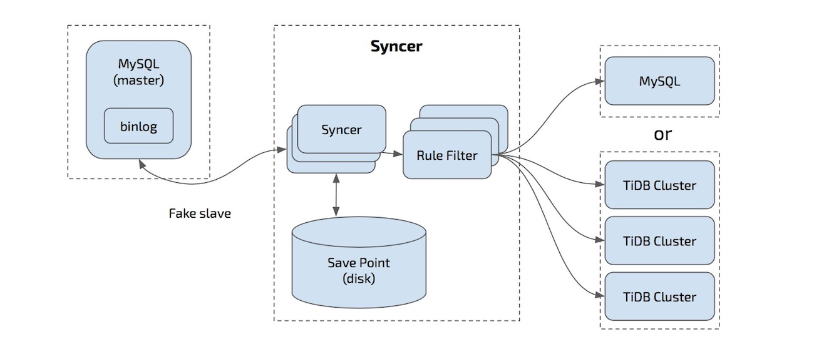

# 目的

通过实时解析MySQL binlog，实现MySQL到CockroachDB的增量数据同步。

# 核心机制

通过实现MySQL Fake Slave来接收MySQL binlog，通过一定规则转化为SQL语句，以MySQL5.7的多线程复制为理论基础，并发执行这些语句。

# 简明架构

## TiDB Syncer架构图

1. 要求row格式的binlog
2. binlog_row_image = full
3. 支持分库分表导入同一张表

## GDB Syncer架构

### FakeSlave 

1. binlog接收
2. 内存缓存，批量写盘，实时记录已经完成同步的binlog位置

#### **流程**

MySQL伪装从库只需如下步骤:
1. 与mysql建立立tcp连接后,ReadInitPacket,获取auth-data和版本信息。
2. 根据auth-data,加密用用户密码后,WriteAuthPacket,发送认证包。
3. 获取mysql server响应包,无无报错后进入入命令模式,向mysql 发送 ComRegisterSlave。
4. 此时己己经伪装成slave,发送ComBinlogDump,开始接受主库推送的数据。
5. 此时根据业务需求,解析不同event type的binlog,分别处理。

### BinlogTranslation

binlog事件解析
1. event header： server_id, event type, event length
2. event body

### job调度模块

MySQL 5.7的并发复制

1. 从binlog中取出一个新事务，取出last_committed和sequence_number
2. 判断当前last_committed是不是已经大于当前已执行的sequence_number的最小值（low water mark, lwm）
3. 若大于，则上一组事务没有完成，需等待lwm变大，直到与last_committed相等
4. 若小于或等于，继续执行，无需等待
5. 从执行线程池中找到空闲线程，进行执行

### 语句执行模块

待设计

### 检查点模块

1. 时间戳检查点
2. 事务完整性检查点（所有事务都commit了）

# 参考项目

https://github.com/danfengcao/binlog2sql

# 笔记

In row format: rows that changed are written to the binlog in a binary format. Each row may consist of a Before Image (BI) and/or an After Image (AI). The BI identifies the row to modify and the AI describes the row after the change. There are three types of log_events:

1. Write_rows_log_event: adds a new row to a table. Has only AI.

2. Update_rows_log_event: modifies an existing row in a table. Has both BI and AI.

3. Delete_rows_log_event: removes an existing row from a table. Has only BI.

Several event types are used specific to row-based logging:

* TABLE_MAP_EVENT

* WRITE_ROWS_EVENT

* UPDATE_ROWS_EVENT

* DELETE_ROWS_EVENT
